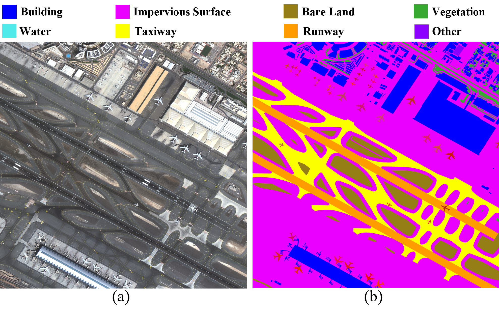

# RSAPS-ASD

A Remote Sensing Airport Panoptic Segmentation with Airplane States Dataset，constructed in “Airplane State Discrimination from Single-temporal High-Resolution Remote Sensing Images”
_____

To ensure the diversity of the dataset, 102 high-resolution satellite remote sensing images with a size of 4000×4000 pixels were selected, totaling over 3500 airplane instances. The images are obtained from the SuperView-1 commercial satellite, which combines four multispectral bands (red, green, blue, and near-infrared) with 0.5 m resolution after pan-sharpening fusion.

The dataset can be obtained via https://github.com/SKLSEIIT/RSAPS-ASD.


## Panoptic Segmentation Annotation
The airport scene in high-resolution remote sensing images is annotated with 11 categories, including “Buildings”, “Impervious Surfaces”, “Bare Land”, “Vegetation”, “Water”, “Runways”, “Taxiways”, and “Other” as 8 stuff categories, with “airplane”, "Ship", "Storage tank" as 3 things categories. (Only use "airplane" category in “Airplane State Discrimination from Single-temporal High-Resolution Remote Sensing Images”)




## Airplane State Annotation
Based on panoptic segmentation, we categorizes airplanes into 8 states. Details are shown in the following table:


|State Category|Annotation Criteria|Sample Quantity|
|:--:|:--:|:--:|
|Takeoff or Landing|Airplanes on the runway|16|
Taxiing|Airplanes on the taxiway or far from buildings without parking markings|305
Parking at Terminal|Airplanes near the terminal with a distance less than one airplane length from the terminal bridge|1332
Parking on Apron|Airplanes far from the terminal with parking markings around the airplane|1394
Parking next Hangar|Airplanes close to the hangar without parking markings around the airplane|244
Parking in Hangar|Airplanes partially obscured by the hangar|46
Retired|Airplanes on Bare Land or in Vegetation areas or multiple airplanes parked closely without parking markings|371
Other|Airplanes with indeterminate states|44
Total||3752


## Citing
If you find our work helpful for your research, please consider citing the following BibTeX entry.

```BibTeX
@misc{
}
```
